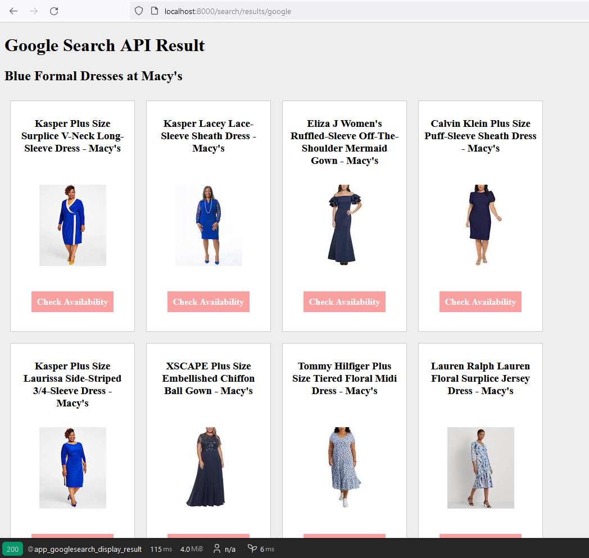

# Symfony Code Example

## Version

**Symfony:** 6

## Symfony and Google Search API

### Summary 

This is a Symfony code example for interacting with the Google Search API with REST and Json. 
It searches with the Google Search Engine for data for a set value (in this case formal blue dresses) at a set store (in this case Macy's) along with other parameters, such as region. For the purpose of the code example the parameters are set manually with a narrow focus, but these could be set with a wider focus, multiple focuses, dynamically,  through user input, or a combination of those factors. The code returns the data such as image of the dress, the link to the store, and the name of the dress. The output is in  HTML in Twig templates. 

Besides the Symfony standard installation the Component HTML Sanitizer and Assets are installed. Assets in installed to help with loading CSS in the Twig Template. While Twig already checks some output out of the box, because dealing with 3rd party data here brought in through the API sanitizing the data before output using HTML Sanitizer. If errors occur during processing the data an error log notification is made in the Symfony log. Because Google Search API has a rate limit (depending on the plan), the results are cached for a set amount of time to save resources. The API key for REST and Search Engine Key, are stored seperately from the main code and encrypted with Symfony Secrets for added security and accessed through servises.yaml.


This code is a proof of concept which intended use is as a code example. 


### Screenshot Result in Browser




## Composer 

### Assets

```
~$ composer require symfony/asset
```

### HTML Sanitizer

```
:~$ composer require symfony/html-sanitizer
```


